# Karazhar Hybrid Mini-Grid — Building Management System (BMS)

**ENG30002 Engineering Technology and Society — Capstone Project**
Swinburne University of Technology Sarawak

A real-time web-based monitoring and control dashboard for a hybrid mini-grid system
serving Karazhar village, Tselinograd District, Akmola Region, Kazakhstan. The system
integrates three renewable and backup generation sources: in-pipe hydropower, solar PV
with battery storage, and diesel generator backup through a Simulink simulation model
connected to a live Flask web dashboard.

---

## Team

| Name | Role |
|---|---|
| Ramisa Nawar | BMS (GUI), web dashboard, Python/Flask infrastructure, MATLAB↔dashboard bridge |
| Yong Jian Lee | Diesel generator subsystem, Simulink fault detection |
| Wan Zhen Voon | Solar PV and battery management |
| Yu Wei Ng | In-pipe hydropower subsystem |

---

## System overview

The mini-grid combines:

- **In-pipe hydropower** — recovers pressure energy from the existing Astana water
  transmission pipeline (700mm diameter, ~0.58 m³/s flow, ~55–60m head)
- **Solar PV + BESS** — LiFePO4 battery storage for residential lighting loads
- **Diesel generator + ATS** — backup power for the school, hospital, and government
  building, activated only when renewable sources and grid supply are unavailable
- **Building Management System (BMS)** — the subject of this repository — a Flask web
  dashboard monitoring 65 real-time signals across all subsystems

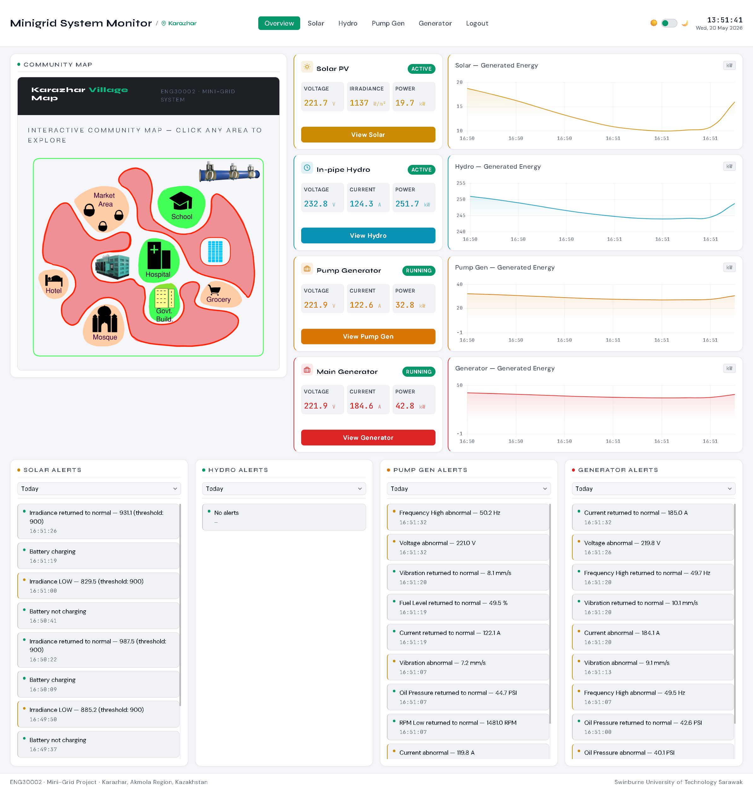

---

## Folder structure

```
miniGridFinal/                     ← MATLAB / Simulink project root
├── *.slx                          ← Simulink model(s)
├── read_pgen_start.m              ← Read blocks (web/Simulink → Stateflow)
├── read_pgen_shutdown.m
├── read_gen_start.m
├── read_gen_shutdown.m
├── read_and_clear_state.m         ← Shared self-clearing file reader
├── write_pgen_start.m             ← Write blocks (physical button → files)
├── write_pgen_shutdown.m
├── write_gen_start.m
├── write_gen_shutdown.m
├── write_pgen_start_file.m
├── write_pgen_shutdown_file.m
├── write_gen_start_file.m
├── write_gen_shutdown_file.m
├── write_all_signals.m            ← 65-signal hydro/gen output block
├── save_to_mat.m
├── save_solar_to_mat.m            ← Separate solar output (faster sample rate)
├── simulink_output.mat            ← Generated at runtime
├── solar_output.mat               ← Generated at runtime
│
└── miniGridKarazhar/               ← Web application root
    ├── app.py                      ← Flask server (dashboard + REST API)
    ├── bridge.py                   ← Simulink ↔ Flask bridge
    ├── demo_push.py                ← Simulated data generator (no MATLAB needed)
    ├── requirements.txt
    ├── Procfile                    ← Render deployment entrypoint
    ├── README.txt                  ← Setup & run instructions
    ├── pgen_start.txt              ← State files (binary int32)
    ├── pgen_shutdown.txt
    ├── gen_start.txt
    ├── gen_shutdown.txt
    ├── alerts_data/                ← Persisted daily alert logs (JSON)
    │
    ├── index.html                  ← Overview page
    ├── solar.html
    ├── hydro.html
    ├── pump_gen.html
    ├── generator.html
    ├── login.html
    │
    ├── overview.js
    ├── solar.js
    ├── hydro.js
    ├── pump_gen.js
    ├── generator.js
    │
    ├── style.css
    ├── images/
    └── screenshot/                 ← Project documentation screenshots
```

---

## Architecture

### Upward flow — Simulink → Dashboard

The Simulink model runs the four subsystems continuously. A `write_all_signals` MATLAB
Function block collects 65 signals (voltages, currents, power, faults, generator running
states) and writes them via `save_to_mat.m` to `simulink_output.mat`. Solar signals are
handled separately through `save_solar_to_mat.m` into `solar_output.mat`, since the solar
PWM subsystem requires a faster sample time (0.01s) than hydro/generators (1s).

`bridge.py` polls both `.mat` files every 0.5 seconds using `scipy.io.loadmat`, builds a
JSON payload, and POSTs it to Flask's `/api/update` endpoint. `app.py` maps the data into
in-memory state, runs threshold and fault-based alert checks, and updates the rolling
chart history. The browser polls the Flask API every 1–2 seconds to render live gauges,
charts, and alerts.

### Downward flow — Dashboard → Simulink

Clicking **Start** or **Stop** on the dashboard sends a command to Flask
(`/api/gen_start` or `/api/gen_shutdown`), which `bridge.py` retrieves on its next poll
and writes as a binary int32 to the corresponding state file (`gen_start.txt` /
`gen_shutdown.txt`). In Simulink, `read_gen_start.m` and `read_gen_shutdown.m` use the
shared `read_and_clear_state.m` helper to read the value, output a single pulse, and
clear the file back to zero — mimicking a momentary push button. This pulse drives the
Stateflow logic (`Start==1` → generator on, `Manual_Shutdown==1` → generator off).

### Downward flow — physical Simulink buttons

Pressing the physical Start/Shutdown push buttons inside Simulink triggers
`write_gen_start.m` / `write_gen_shutdown.m`, which call helper functions writing to the
**same state files** used by the web dashboard path — ensuring a single source of truth
regardless of which interface issued the command.

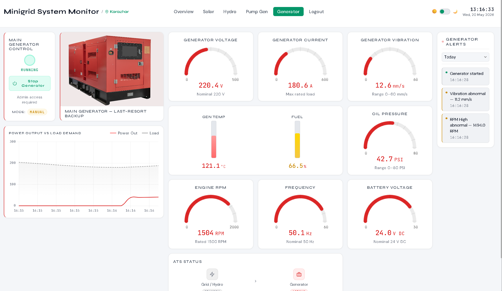

---

## Dashboard pages

| Page | Description | Screenshot |
|---|---|---|
| **Overview** | System-wide power summary across all subsystems |  |
| **Solar** | PV voltage, irradiance, SOC, panel temperature | 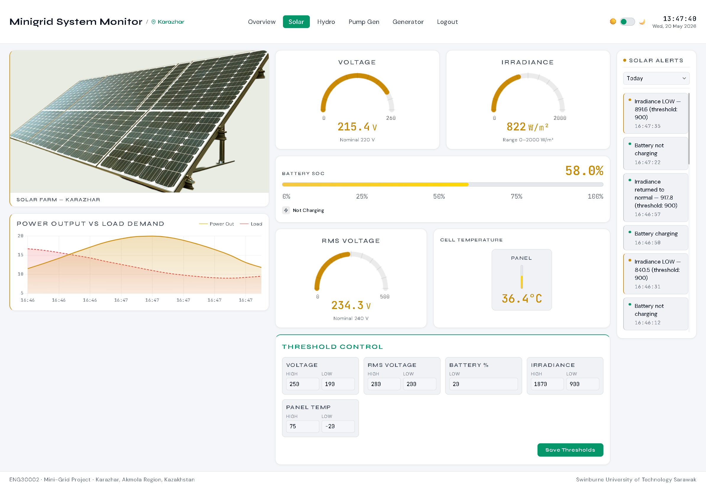 |
| **Hydro** | In-pipe hydro power, flow rate, pressure | 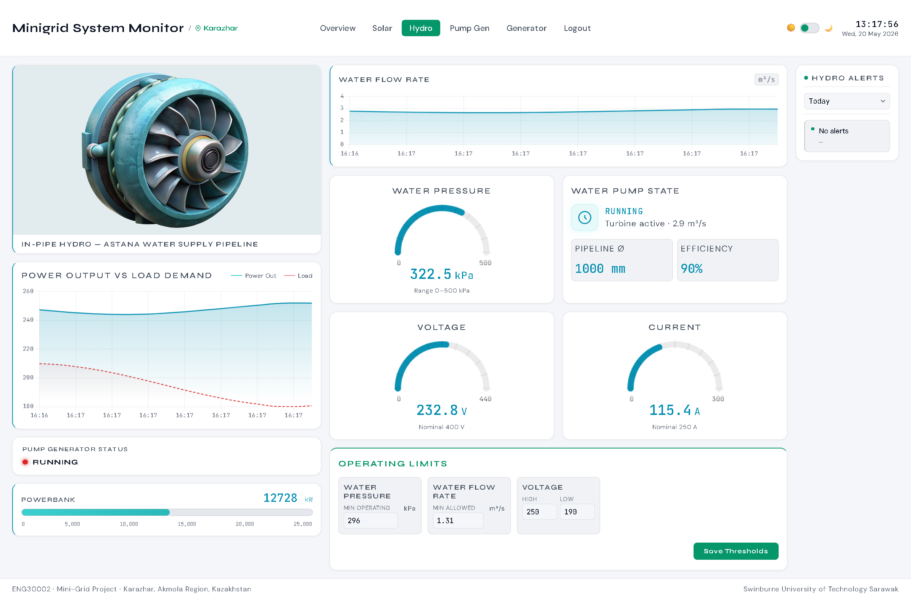 |
| **Pump generator** | Pump generator gauges, fault status, controls | 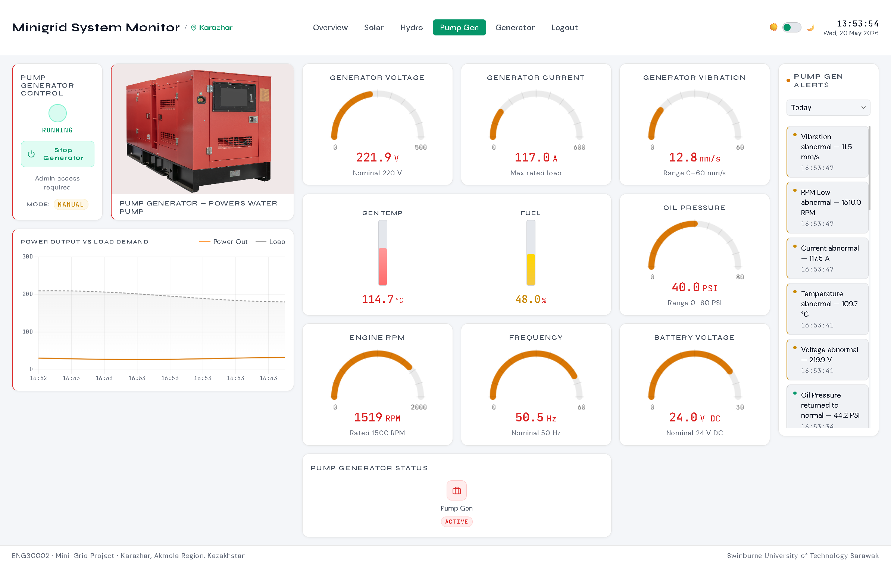 |
| **Generator** | Main generator gauges, ATS status, controls |  |
| **Login** | Session-based authentication | 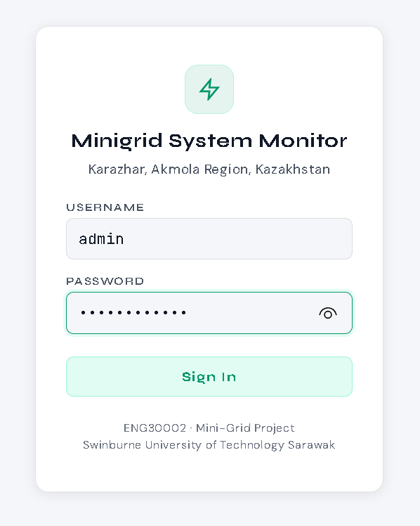 |
| **Alerts** | Threshold and fault-triggered alert log, filterable by date | 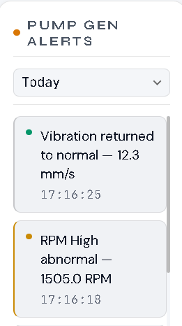 |

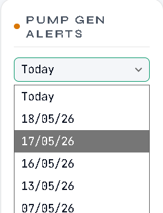

### Dark mode

The dashboard supports both light and dark themes.

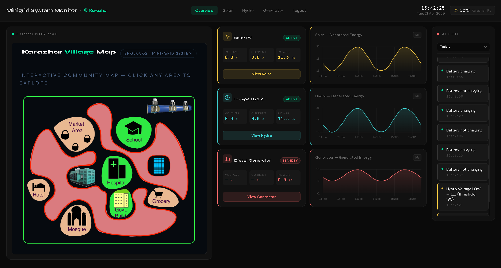

### Mobile support

The dashboard is fully responsive and usable on mobile devices for on-site monitoring.

| Light | Dark |
|---|---|
| 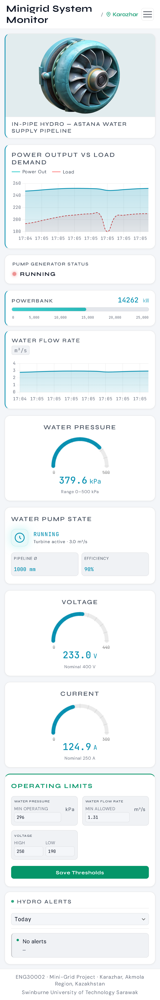 | 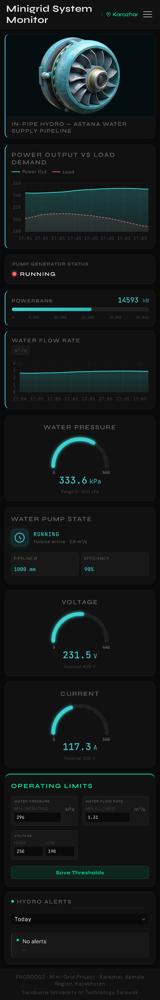 |

A QR code is provided for quick mobile access to the live dashboard URL.

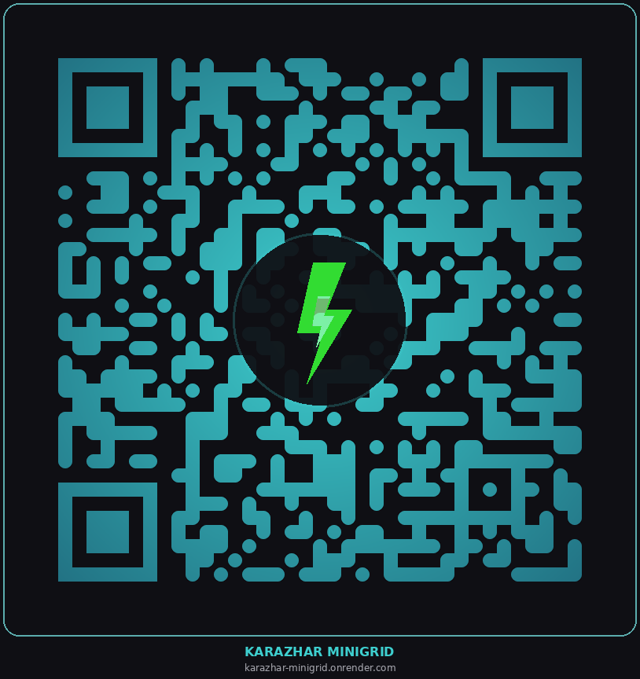

### Location context

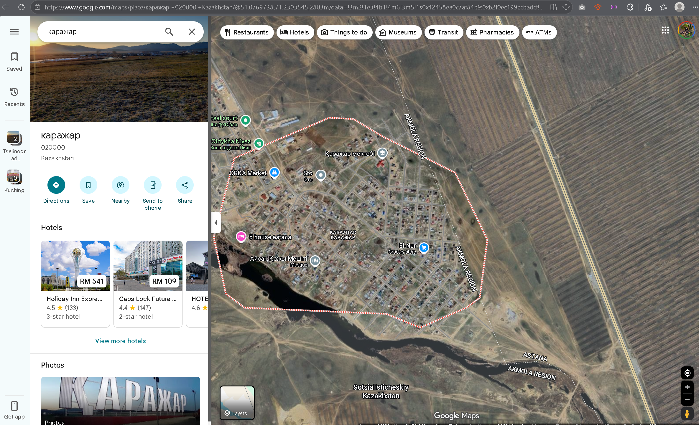

An interactive map view is also available for visualising the pipeline and generation
site locations.

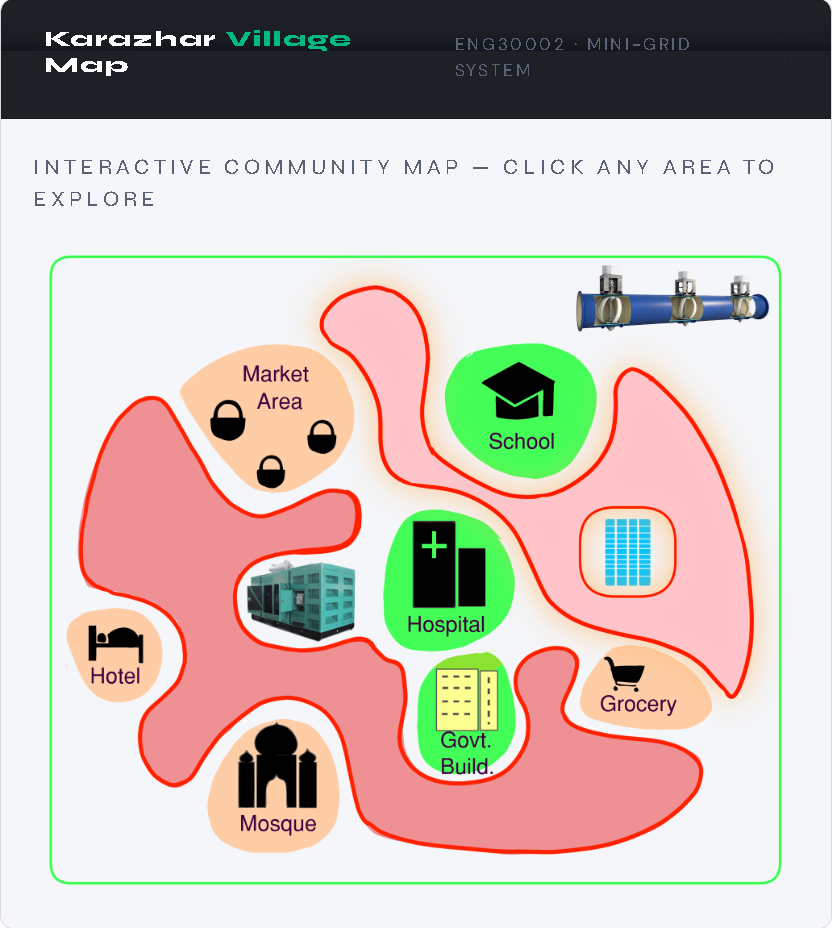

### Live signal readings

Example readings from the hydro and solar subsystems as displayed on the dashboard:

| Hydro reading | Solar reading |
|---|---|
| 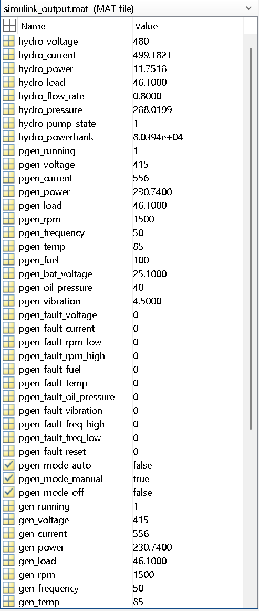 | 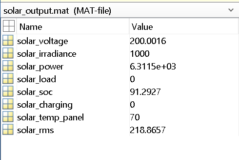 |

---

## Communication summary

| File | Location | Written by | Read by |
|---|---|---|---|
| `simulink_output.mat` | `miniGridFinal/` | Simulink (`save_to_mat.m`) | `bridge.py` |
| `solar_output.mat` | `miniGridFinal/` | Simulink (`save_solar_to_mat.m`) | `bridge.py` |
| `pgen_start.txt` | `miniGridKarazhar/` | `bridge.py` or `write_pgen_start_file.m` | `read_pgen_start.m` |
| `pgen_shutdown.txt` | `miniGridKarazhar/` | `bridge.py` or `write_pgen_shutdown_file.m` | `read_pgen_shutdown.m` |
| `gen_start.txt` | `miniGridKarazhar/` | `bridge.py` or `write_gen_start_file.m` | `read_gen_start.m` |
| `gen_shutdown.txt` | `miniGridKarazhar/` | `bridge.py` or `write_gen_shutdown_file.m` | `read_gen_shutdown.m` |

**Key principle:** Simulink is the single source of truth for whether a generator is
running. `bridge.py` never tracks state locally — it only relays commands downward and
reads results upward.

---

## Running the project

See [`miniGridKarazhar/README.txt`](miniGridKarazhar/README.txt) for full setup
instructions, including Python installation, package requirements, and both the full
Simulink-integrated mode and the MATLAB-free demo mode using `demo_push.py`.

**Quick start (demo mode, no MATLAB required):**

```bash
cd miniGridKarazhar
pip install -r requirements.txt

# Terminal 1
python app.py

# Terminal 2
python demo_push.py
```

Open `http://127.0.0.1:5000` and log in with `admin` / `karazhar2026`.

---

## Deployment

The Flask application (`app.py`) is deployed to [Render](https://render.com), with
`bridge.py` run locally alongside the Simulink model, pointing to the deployed URL. A
scheduled keep-alive ping (Google Apps Script or UptimeRobot) prevents the free-tier
instance from spinning down during idle periods.

---

## Tech stack

- **Simulink / MATLAB R2024b** — physical system simulation, Stateflow generator logic
- **Python (Flask, SciPy, gunicorn)** — web server and Simulink↔web bridge
- **HTML / CSS / JavaScript, Chart.js, Canvas API** — dashboard front-end
- **Render** — cloud deployment
